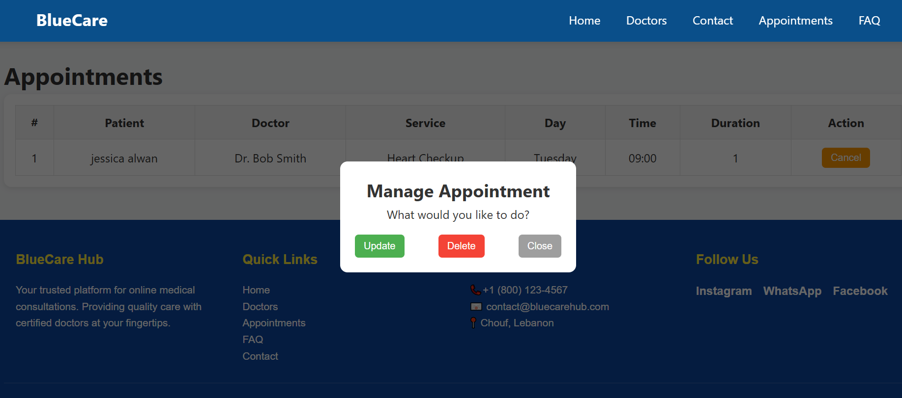

Project Description

BlueCareHub is an online doctor appointment booking platform.
It allows patients to view available doctors, explore medical services, select time slots, and book appointments online.
The system also allows managing appointments through a connected backend and database.

The project is developed as part of CSCI426 – Advanced Web Programming (Phase 2).

## Technologies Used

- Frontend: React.js, CSS
- Backend: Node.js, Express
- Database: MySQL
- Version Control: Git & GitHub
- Deployment: GitHub Pages (frontend), Render (backend)

## Project Structure
BlueCareHub/
├── frontend/ → React frontend
├── backend/ → Node.js backend
├── database.sql → MySQL schema
└── README.md

# Screenshots
### Homepage

### doctor list page

### doctorSevices page

### Appointment Page

###confermation

### delete and update 

### FAQpage page

##Database schema
CREATE TABLE `bookings` (
  `id` int(11) NOT NULL,
  `doctor_id` int(11) NOT NULL,
  `user_id` int(11) NOT NULL,
  `service_name` varchar(100) NOT NULL,
  `day` varchar(20) NOT NULL,
  `time` varchar(10) NOT NULL,
  `duration` float NOT NULL,
  `created_at` timestamp NOT NULL DEFAULT current_timestamp()
) ENGINE=InnoDB DEFAULT CHARSET=utf8mb4 COLLATE=utf8mb4_general_ci;

-- --------------------------------------------------------

--
-- Table structure for table `contacts`
--

CREATE TABLE `contacts` (
  `id` int(11) NOT NULL,
  `name` varchar(100) NOT NULL,
  `email` varchar(100) NOT NULL,
  `phone` varchar(20) DEFAULT NULL,
  `subject` varchar(255) DEFAULT NULL,
  `message` text NOT NULL,
  `created_at` timestamp NOT NULL DEFAULT current_timestamp()
) ENGINE=InnoDB DEFAULT CHARSET=utf8mb4 COLLATE=utf8mb4_general_ci;

-- --------------------------------------------------------

--
-- Table structure for table `doctors`
--

CREATE TABLE `doctors` (
  `id` int(11) NOT NULL,
  `name` varchar(100) NOT NULL,
  `specialty` varchar(100) DEFAULT NULL,
  `description` text DEFAULT NULL,
  `image` varchar(255) DEFAULT NULL
) ENGINE=InnoDB DEFAULT CHARSET=utf8mb4 COLLATE=utf8mb4_general_ci;

--
-- Dumping data for table `doctors`
--

INSERT INTO `doctors` (`id`, `name`, `specialty`, `description`, `image`) VALUES
(1, 'Dr. Alice Johnson', 'Dentist', 'Expert in dental care and oral hygiene.', 'doctor1.jpg'),
(2, 'Dr. Bob Smith', 'Cardiologist', 'Specialist in heart and vascular health.', 'doctor2.jpg'),
(3, 'Dr. Carol Lee', 'Dermatologist', 'Skin care specialist for acne, eczema, and cosmetic treatments.', 'doctor3.jpg'),
(4, 'Dr. David Brown', 'Dentist (Orthodontist)', 'Dental surgeon and orthodontist.', 'doctor4_alt.jpg'),
(5, 'Dr. Emma White', 'Neurologist', 'Brain and nervous system specialist.', 'doctor5.jpg'),
(6, 'Dr. Frank Green', 'Pediatrician', 'Child healthcare expert.', 'doctor6.jpg'),
(7, 'Dr. Grace Kim', 'Orthopedic', 'Bone and joint specialist.', 'doctor7.jpg'),
(8, 'Dr. Henry Adams', 'Ophthalmologist', 'Eye specialist and surgeon.', 'doctor8.jpg'),
(9, 'Dr. Irene Scott', 'ENT Specialist', 'Ear, nose, and throat expert.', 'doctor9.jpg');

-- --------------------------------------------------------

--
-- Table structure for table `services`
--

CREATE TABLE `services` (
  `id` int(11) NOT NULL,
  `doctor_id` int(11) NOT NULL,
  `name` varchar(100) NOT NULL,
  `duration` float NOT NULL,
  `price` decimal(10,2) DEFAULT NULL
) ENGINE=InnoDB DEFAULT CHARSET=utf8mb4 COLLATE=utf8mb4_general_ci;

--
-- Dumping data for table `services`
--

INSERT INTO `services` (`id`, `doctor_id`, `name`, `duration`, `price`) VALUES
(1, 1, 'Check-up', 1, 50.00),
(2, 1, 'Cleaning', 1, 60.00),
(3, 1, 'Whitening', 1.5, 70.00),
(4, 2, 'Heart Checkup', 1, 80.00),
(5, 2, 'ECG', 0.5, 40.00),
(6, 3, 'Skin Check', 0.5, 45.00),
(7, 3, 'Acne Treatment', 1, 60.00),
(8, 3, 'Cosmetic Consultation', 1, 70.00),
(9, 4, 'Braces Consultation', 1, 90.00),
(10, 4, 'Check-up', 0.75, 50.00),
(11, 5, 'Neurological Exam', 1, 100.00),
(12, 5, 'Consultation', 1, 80.00),
(13, 6, 'Wellness Check', 0.5, 40.00),
(14, 6, 'Vaccination', 0.25, 30.00),
(15, 7, 'Initial Consultation', 1, 50.00),
(16, 7, 'Physio Session', 0.5, 45.00),
(17, 8, 'Eye Exam', 0.5, 50.00),
(18, 8, 'Surgery Consultation', 1, 100.00),
(19, 9, 'ENT Checkup', 0.5, 40.00),
(20, 9, 'Hearing Test', 0.5, 45.00);

-- --------------------------------------------------------

--
-- Table structure for table `time_slots`
--

CREATE TABLE `time_slots` (
  `id` int(11) NOT NULL,
  `doctor_id` int(11) NOT NULL,
  `day` varchar(20) NOT NULL,
  `time` varchar(10) NOT NULL
) ENGINE=InnoDB DEFAULT CHARSET=utf8mb4 COLLATE=utf8mb4_general_ci;

--
-- Dumping data for table `time_slots`
--

INSERT INTO `time_slots` (`id`, `doctor_id`, `day`, `time`) VALUES
(1, 1, 'Monday', '09:00'),
(2, 1, 'Monday', '10:00'),
(3, 1, 'Monday', '11:00'),
(4, 1, 'Monday', '14:00'),
(5, 1, 'Wednesday', '09:00'),
(6, 1, 'Wednesday', '10:30'),
(7, 1, 'Wednesday', '13:00'),
(8, 1, 'Friday', '10:00'),
(9, 1, 'Friday', '11:00'),
(10, 1, 'Friday', '15:00'),
(11, 2, 'Tuesday', '09:00'),
(12, 2, 'Tuesday', '11:00'),
(13, 2, 'Tuesday', '14:00'),
(14, 2, 'Thursday', '10:00'),
(15, 2, 'Thursday', '13:00'),
(16, 3, 'Monday', '09:30'),
(17, 3, 'Monday', '10:30'),
(18, 3, 'Monday', '12:00'),
(19, 3, 'Friday', '09:00'),
(20, 3, 'Friday', '11:00'),
(21, 3, 'Friday', '14:00'),
(22, 4, 'Tuesday', '09:00'),
(23, 4, 'Tuesday', '10:00'),
(24, 4, 'Tuesday', '11:00'),
(25, 4, 'Thursday', '09:00'),
(26, 4, 'Thursday', '10:30'),
(27, 4, 'Thursday', '13:30'),
(28, 5, 'Monday', '10:00'),
(29, 5, 'Monday', '11:30'),
(30, 5, 'Wednesday', '09:00'),
(31, 5, 'Wednesday', '12:00'),
(32, 5, 'Wednesday', '15:00'),
(33, 6, 'Tuesday', '09:00'),
(34, 6, 'Tuesday', '09:30'),
(35, 6, 'Tuesday', '10:00'),
(36, 6, 'Tuesday', '11:00'),
(37, 6, 'Friday', '09:00'),
(38, 6, 'Friday', '10:00'),
(39, 6, 'Friday', '11:00'),
(40, 7, 'Monday', '10:00'),
(41, 7, 'Monday', '11:00'),
(42, 7, 'Monday', '14:00'),
(43, 7, 'Thursday', '09:00'),
(44, 7, 'Thursday', '13:00'),
(45, 7, 'Thursday', '15:00'),
(46, 8, 'Wednesday', '09:00'),
(47, 8, 'Wednesday', '10:00'),
(48, 8, 'Wednesday', '11:00'),
(49, 8, 'Friday', '09:30'),
(50, 8, 'Friday', '10:30'),
(51, 9, 'Tuesday', '09:00'),
(52, 9, 'Tuesday', '10:00'),
(53, 9, 'Tuesday', '11:00'),
(54, 9, 'Thursday', '09:00'),
(55, 9, 'Thursday', '12:00'),
(56, 9, 'Thursday', '14:00');

-- --------------------------------------------------------

--
-- Table structure for table `users`
--

CREATE TABLE `users` (
  `id` int(11) NOT NULL,
  `full_name` varchar(100) NOT NULL,
  `phone` varchar(20) NOT NULL,
  `email` varchar(100) NOT NULL,
  `created_at` timestamp NOT NULL DEFAULT current_timestamp()
) ENGINE=InnoDB DEFAULT CHARSET=utf8mb4 COLLATE=utf8mb4_general_ci;

--
